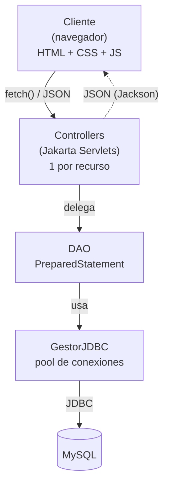
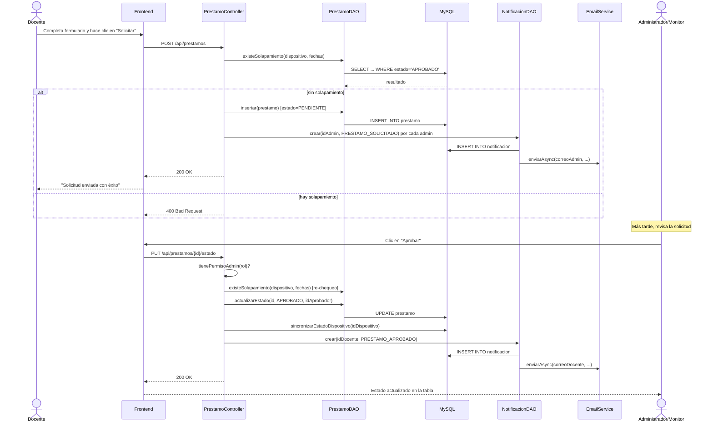
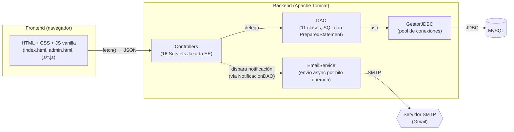
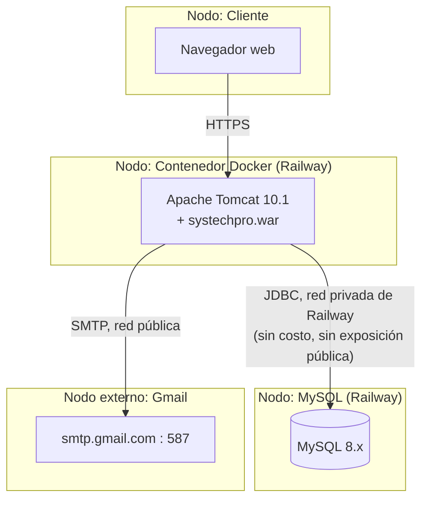
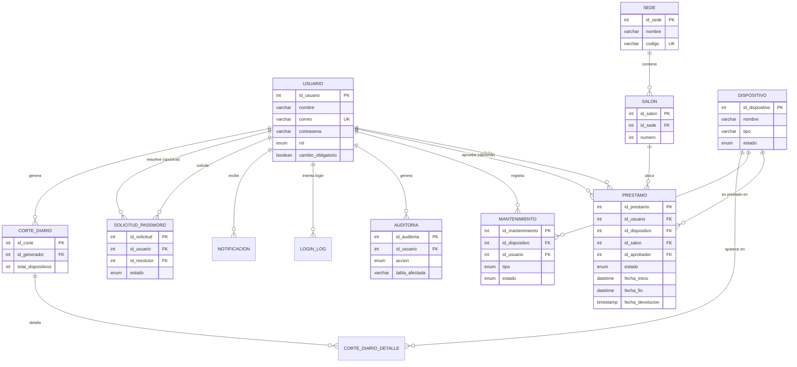
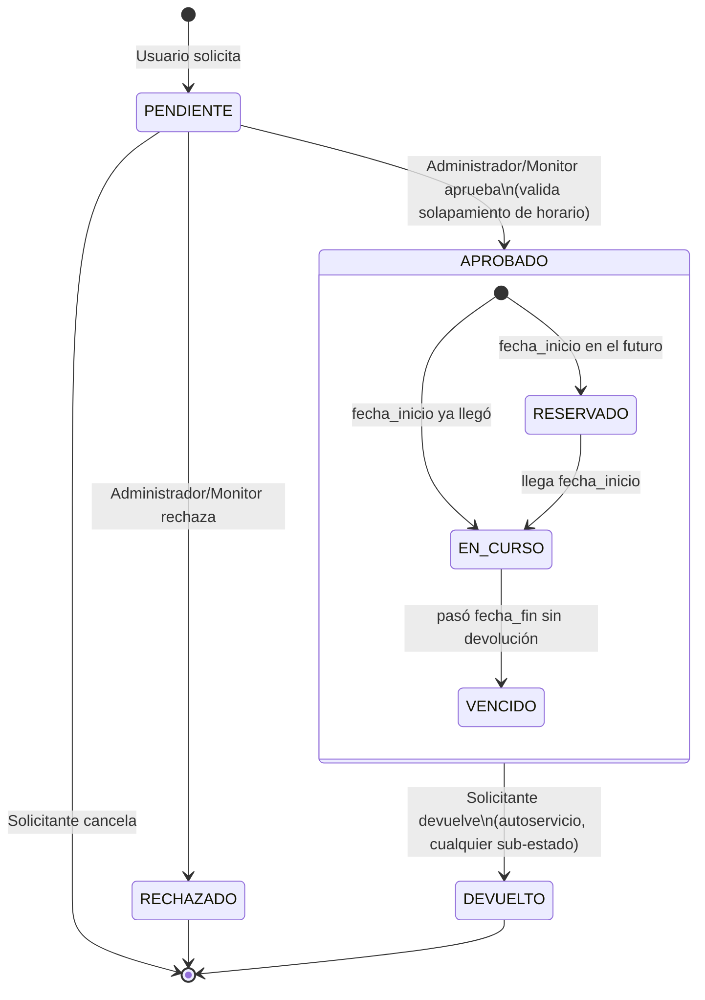

# Documentación Técnica — SysTechPro

**Versión registrada:** ver tag `v1.0-dnda` (commit `4285550`, 2026-08-06).
**Propósito de este documento:** describir la arquitectura, el stack tecnológico y los módulos funcionales de SysTechPro tal como existen en el código fuente depositado, como soporte técnico para el registro ante la Dirección Nacional de Derecho de Autor (DNDA) de Colombia.

---

## 1. Descripción general

SysTechPro es un sistema de gestión de dispositivos tecnológicos (HelpDesk). Permite administrar el inventario de dispositivos, gestionar préstamos con reserva anticipada, registrar mantenimientos, controlar usuarios y roles, generar reportes y auditar la actividad del sistema.

Es una aplicación web Java tradicional (Jakarta EE / Servlets), sin frameworks de frontend ni de persistencia — arquitectura MVC clásica servida íntegramente por Apache Tomcat.

---

## 2. Arquitectura

### 2.1 Flujo general

```
┌─────────────┐      HTTP (fetch / JSON)      ┌──────────────────────┐
│   Cliente   │ ─────────────────────────────▶ │  Controllers          │
│ (navegador) │                                 │  (Jakarta Servlets)   │
│             │ ◀───────────────────────────── │  1 servlet por recurso│
└─────────────┘         JSON (Jackson)          └───────────┬───────────┘
      ▲                                                     │
      │ HTML + CSS + JS servidos como                       ▼
      │ archivos estáticos por Tomcat                ┌──────────────┐
      │                                               │     DAO       │
      │                                               │ (SQL con      │
      │                                               │ PreparedStmt) │
      │                                               └───────┬────────┘
      │                                                       ▼
      │                                               ┌──────────────┐
      │                                               │  GestorJDBC   │
      │                                               │ (pool Tomcat  │
      │                                               │  JDBC)        │
      │                                               └───────┬────────┘
      │                                                       ▼
      │                                               ┌──────────────┐
      └───────────────────────────────────────────────│    MySQL      │
                                                        └──────────────┘
```

Versión visual del mismo flujo:



### 2.2 Capas

| Capa | Ubicación | Responsabilidad |
|---|---|---|
| **Cliente** | `src/main/webapp/*.html`, `js/`, `css/` | HTML + CSS + JavaScript sin frameworks ("vanilla"). Consume la API vía `fetch()`, renderiza el DOM manualmente. No hay build step ni transpilación: los archivos se sirven tal cual desde `webapp/`. |
| **Controllers** | `src/main/java/com/systechpro/controllers/` | Servlets Jakarta EE, uno por recurso (`/api/prestamos/*`, `/api/dispositivos/*`, etc.). Reciben la petición HTTP, validan sesión y rol, parsean parámetros/JSON de entrada, delegan al DAO correspondiente y serializan la respuesta a JSON con Jackson. No contienen SQL. |
| **DAO** | `src/main/java/com/systechpro/dao/` | Toda la lógica de acceso a datos. Cada DAO expone métodos como `listar()`, `insertar()`, `actualizar()`, `buscarPorId()`, usando siempre `PreparedStatement` (nunca concatenación de texto en el SQL). Aquí vive la lógica de negocio que depende de consultas (ej. sincronización del estado de un dispositivo, cálculo de solapamiento de horarios). |
| **GestorJDBC** | `src/main/java/com/systechpro/utils/GestorJDBC.java` | Pool de conexiones (`org.apache.tomcat.jdbc.pool.DataSource`, el pool JDBC que trae Tomcat 10+). Único punto de conexión a MySQL en toda la aplicación. |
| **MySQL** | — | Persistencia. Ver sección 5 (Modelo de datos). |

### 2.3 Autenticación y sesión

Login vía `AuthController` → `UsuarioDAO.buscarPorCorreo()` → verificación de contraseña con BCrypt (`Encriptador`, sobre `org.mindrot.jbcrypt`) → si es válida, se crea una `HttpSession` de servlet con el usuario y su rol. Cada endpoint protegido valida la sesión y el rol en el propio Controller antes de delegar al DAO. No se usa JWT ni tokens: la sesión es server-side, estándar de Servlets.

**Cambio de contraseña obligatorio:** si la cuenta tiene el flag `cambio_obligatorio` activo (se activa automáticamente al aprobarse una solicitud de restablecimiento de contraseña, junto con la contraseña temporal), el login no abre sesión: responde `requirePasswordChange: true` y el frontend obliga a definir una nueva contraseña (`POST /api/auth/change-password`) antes de poder volver a intentar iniciar sesión normalmente.

Protecciones adicionales implementadas:
- **Rate limiting de login** (`LoginRateLimiter`, en memoria): bloquea intentos tras varios fallos consecutivos por correo.
- **Cabeceras de seguridad + CSP** (`SecurityHeadersFilter`, no listado en la tabla de Controllers por no ser un Servlet sino un `Filter`).
- **Cookie de sesión `SameSite=Lax`** (mitigación CSRF), configurada en `META-INF/context.xml`.
- Contraseñas nunca se devuelven en las respuestas JSON de usuarios (se eliminan explícitamente del objeto antes de serializar).

### 2.4 Diagrama de secuencia — solicitud y aprobación de un préstamo

Flujo completo, desde que un Docente solicita hasta que un Administrador/Monitor aprueba, con la notificación (in-panel + correo) en ambos extremos:



### 2.5 Diagrama de componentes



### 2.6 Diagrama de despliegue

Topología real de la instancia de producción (Railway) — el desarrollo local usa el mismo esquema con Tomcat y MySQL en la misma máquina en vez de en nodos separados:



---

## 3. Stack tecnológico

Versiones exactas, tomadas de `pom.xml` y del entorno de build/despliegue real (no supuestas):

| Componente | Versión | Notas |
|---|---|---|
| Java | 17 | `maven.compiler.source`/`target` en `pom.xml`. El JDK instalado en la máquina de desarrollo es más nuevo (25), pero el proyecto se compila explícitamente en modo compatibilidad Java 17. |
| Maven | 3.9.9 | Herramienta de build. |
| Jakarta Servlet API | 6.0.0 | `provided` — la implementación real la aporta Tomcat en tiempo de ejecución. |
| Apache Tomcat | 10.1.x | Servidor de aplicaciones. Desarrollo local sobre 10.1.54; despliegue en contenedor Docker sobre la imagen `tomcat:10.1-jdk17-temurin`. |
| MySQL Connector/J | 8.3.0 | Driver JDBC oficial de Oracle (`com.mysql.cj.jdbc.Driver`). |
| Tomcat JDBC Pool | 10.1.19 | `provided` — pool de conexiones, ya incluido en la distribución de Tomcat 10.1+. |
| Jackson Databind | 2.16.1 | Serialización/deserialización JSON. |
| jBCrypt | 0.4 | Hashing de contraseñas (BCrypt). |
| Angus Mail | 2.0.3 | Envío de correo SMTP para notificaciones por email (sucesor de JavaMail tras la migración de `javax` a `jakarta`). |
| JUnit Jupiter | 5.10.2 | Tests unitarios (alcance: lógica pura — enums, validadores, utilidades; sin tests de integración contra base de datos, ver sección 8). |
| MySQL (motor de base de datos) | 8.x | Confirmado por el uso del plugin de autenticación `caching_sha2_password` (por defecto desde MySQL 8.0) en el proveedor de base de datos de producción. El entorno de desarrollo local usa MariaDB 10.4 (vía XAMPP) como sustituto compatible — el código no usa ninguna sintaxis específica de un motor u otro. |

**Frontend:** HTML5, CSS3 y JavaScript sin framework (ni React, Angular, Vue, ni herramientas de build como Webpack/Vite). Los únicos scripts de terceros son `chart.js` (gráficos en Reportes) y `xlsx.full.min.js` (exportación a Excel), cargados como archivos estáticos.

**Contenedorización:** `Dockerfile` multi-etapa (compila con `maven:3.9-eclipse-temurin-17`, corre sobre `tomcat:10.1-jdk17-temurin`) para despliegue en proveedores tipo Railway/Render.

---

## 4. Estructura del proyecto

```
src/main/java/com/systechpro/
├── controllers/    16 Servlets — reciben peticiones HTTP, validan sesión/rol, delegan a DAO
├── dao/             11 clases — toda la interacción con MySQL (SELECT/INSERT/UPDATE/DELETE)
├── models/           15 clases — POJOs (entidades + enums de estado)
└── utils/             6 clases — GestorJDBC, Encriptador, EmailService, LoginRateLimiter,
                                   PaginacionUtil, ValidadorTexto

src/main/resources/
└── database.sql     Esquema completo de la base de datos (ver sección 5)

src/main/webapp/
├── index.html        Login
├── admin.html        Shell único de la aplicación autenticada (todas las secciones/roles)
├── js/               13 archivos — un archivo por módulo funcional + utilidades compartidas
├── css/               1 archivo de estilos
├── img/               Logo institucional
└── WEB-INF/           web.xml y configuración de despliegue

src/test/java/com/systechpro/
└── (7 archivos)      Tests unitarios JUnit 5 (modelos y utilidades)
```

**Convención de capas (impuesta y respetada en todo el código):** los Controllers nunca contienen SQL; los DAO nunca contienen lógica de presentación; el frontend nunca accede a la base de datos directamente, solo a través de la API JSON expuesta por los Controllers.

---

## 5. Modelo de datos

**Nota sobre la fuente:** esta sección se basa en `src/main/resources/database.sql`, verificado columna por columna contra `database_produccion.sql` (volcado real de la base de producción) — ambos coinciden exactamente en las 12 tablas, sin diferencias.

12 tablas, motor InnoDB, charset `utf8mb4`.

**Diagrama entidad-relación:**



*(`login_log` y `notificacion` se omiten del diagrama por simplicidad visual — ambas solo tienen una FK simple a `usuario`, ya reflejada en la lista de relaciones de arriba.)*

| Tabla | Descripción | Relaciones principales |
|---|---|---|
| `usuario` | Cuentas del sistema: nombre, correo (único), contraseña (hash BCrypt), rol, fecha de creación. | Referenciada por casi todas las demás tablas (quién hizo qué). |
| `dispositivo` | Inventario: nombre, tipo, estado (`DISPONIBLE`/`EN_USO`/`MANTENIMIENTO`), descripción. El estado es un campo **derivado**: solo lo cambian los flujos de préstamo y mantenimiento, nunca una edición manual directa. | Referenciada por `prestamo`, `mantenimiento`, `corte_diario_detalle`. |
| `sede` | Sedes físicas de la institución (nombre, código único). | Padre de `salon`. |
| `salon` | Salones/espacios dentro de una sede (número, sede). | Hijo de `sede`; referenciado por `prestamo`. |
| `prestamo` | Solicitud/préstamo de un dispositivo: usuario solicitante, dispositivo, salón, ventana de fecha (inicio/fin), estado (`PENDIENTE`/`APROBADO`/`RECHAZADO`/`DEVUELTO`), quién lo aprobó (`id_aprobador`), fecha real de devolución. Soporta reservas a futuro con validación de solapamiento de horario por dispositivo. | FK a `usuario` (solicitante y aprobador), `dispositivo`, `salon`. |
| `mantenimiento` | Registro de mantenimiento de un dispositivo: tipo (`PREVENTIVO`/`CORRECTIVO`), ventana de fechas, estado (`EN_PROCESO`/`FINALIZADO`), técnico responsable. | FK a `dispositivo`, `usuario`. |
| `usuario.rol` (enum) | `ADMINISTRADOR`, `DOCENTE`, `TECNICO`, `ADMINISTRATIVO`, `MONITOR`. | — |
| `auditoria` | Bitácora de eventos: quién, sobre qué tabla, qué acción (`INSERT`/`UPDATE`/`DELETE`/`LOGIN`), IP, fecha. **Alcance real:** registra inicios de sesión y altas/ediciones/bajas de `usuario` y `dispositivo` únicamente — no registra cambios de estado de préstamos ni mantenimientos. | FK a `usuario`. |
| `login_log` | Registro de intentos de inicio de sesión (exitoso/fallido) con IP. | FK a `usuario` (nullable, si el correo no existe). |
| `solicitud_password` | Solicitudes de restablecimiento de contraseña: estado (`PENDIENTE`/`APROBADA`/`RECHAZADA`), quién la resolvió, contraseña temporal generada (con expiración de 24h para dejar de mostrarse). | FK a `usuario` (solicitante y resolutor). |
| `notificacion` | Notificaciones internas mostradas en el ícono de campana del panel (leída/no leída). Cada notificación creada aquí también dispara, de forma transparente, un correo vía `EmailService` si hay credenciales SMTP configuradas. | FK a `usuario`. |
| `corte_diario` | Snapshot del estado del inventario en un momento dado: totales de disponibles/en préstamo/en mantenimiento, quién lo generó. | FK a `usuario` (generador). |
| `corte_diario_detalle` | Detalle del corte: qué dispositivo estaba en préstamo y con quién, al momento del corte. | FK a `corte_diario`, `dispositivo`, `usuario`. |

---

## 6. Módulos funcionales

| Módulo | Descripción |
|---|---|
| **Dispositivos** | Inventario de equipos. Alta/edición/baja restringida a `ADMINISTRADOR`; consulta abierta a cualquier usuario autenticado. El estado (Disponible/En uso/Mantenimiento) es calculado por el sistema, no editable a mano, para evitar inconsistencias entre lo que el dispositivo dice y lo que realmente refleja un préstamo o mantenimiento activo. Incluye una vista de trazabilidad ("¿quién lo tiene y quién lo aprobó ahora mismo?") por dispositivo. |
| **Préstamos** | Solicitud, aprobación/rechazo y devolución de dispositivos, con soporte de **reserva anticipada** (fecha/hora futura) y validación automática de solapamiento de horario para el mismo dispositivo. Distingue visualmente una reserva futura (RESERVADO) de un préstamo en curso (EN CURSO) y de uno cuya fecha de fin ya pasó sin devolución registrada (VENCIDO). La devolución es autoservicio: el propio solicitante devuelve su préstamo, sin pasar por un administrador. |
| **Mantenimiento** | Registro de mantenimientos preventivos/correctivos sobre un dispositivo, con apertura y cierre (finalización) del proceso. Mientras un dispositivo está en mantenimiento, el sistema lo excluye de la sincronización automática de estado por préstamos. |
| **Usuarios** | Alta, edición, baja y asignación de rol de las cuentas del sistema. Exclusivo de `ADMINISTRADOR`. |
| **Auditoría** | Consulta (con búsqueda y filtro por rango de fechas) de la bitácora de inicios de sesión y cambios sobre usuarios/dispositivos. Exclusivo de `ADMINISTRADOR`. |
| **Solicitudes Clave** | Flujo de restablecimiento de contraseña: un usuario que la olvidó genera una solicitud, un administrador la aprueba (lo que genera una contraseña temporal, enviada por correo, y marca la cuenta para exigir cambio de contraseña en el próximo login) o la rechaza. Exclusivo de `ADMINISTRADOR` para la resolución. |
| **Reportes** | Panel analítico (solo `ADMINISTRADOR`): dispositivos más prestados, duración promedio real de préstamo, alertas de mantenimientos con más de 3 días en proceso, distribución de estado del inventario, uso agregado por día de la semana. |
| **Corte Diario** | Snapshot del estado del inventario en un momento dado (cuántos dispositivos disponibles/en préstamo/en mantenimiento, y el detalle de quién tiene cada uno), generado bajo demanda y conservado como historial. Disponible para `ADMINISTRADOR`, `TECNICO` y `MONITOR`. |
| **Notificaciones** | Transversal a varios módulos (no un panel propio): notificaciones en el ícono de campana del panel más envío de correo automático, disparadas por eventos de préstamos, solicitudes de contraseña y mantenimientos. |

### 6.1 Ciclo de vida de un préstamo

El flujo más representativo del sistema (combina autorización por rol, reserva anticipada y autoservicio):



Los tres sub-estados de `APROBADO` (RESERVADO/EN CURSO/VENCIDO) no son valores distintos en la base de datos — `prestamo.estado` solo guarda `APROBADO`; la distinción se calcula en el momento comparando `fecha_inicio`/`fecha_fin` contra la hora actual, tanto para el color del badge en el frontend como para la sincronización del estado del dispositivo relacionado.

*(Nota: `sede` y `salon` existen como tablas de datos de referencia y tienen endpoints de solo lectura (`SedeController`, `SalonController`), pero **no tienen todavía una pantalla de administración** en el panel — su carga/edición se hace directamente por SQL. No se cuentan como "módulo" con interfaz propia.)*

---

## 7. Roles y permisos

| Rol | Secciones visibles en el panel | Acciones principales |
|---|---|---|
| **Administrador** | Inicio, Usuarios, Dispositivos, Préstamos, Mantenimiento, Auditoría, Reportes, Solicitudes Clave, Corte Diario | Control total: CRUD de usuarios y dispositivos, aprobar/rechazar cualquier préstamo, ver auditoría completa, generar reportes, resolver solicitudes de contraseña, generar/ver corte diario. |
| **Técnico** | Inicio (panel propio), Mantenimiento, Corte Diario | Registrar y finalizar mantenimientos; generar/ver corte diario. *(Nota técnica: a nivel de backend, Técnico tiene el mismo permiso que Administrador/Monitor para aprobar o rechazar préstamos — pero no existe un ítem de navegación para Préstamos en su interfaz, por lo que en la práctica no ejerce esa acción a través del panel. Ver sección 9.)* |
| **Docente** | Inicio, Mis Solicitudes | Solicitar préstamos (incluida reserva a futuro); ver, cancelar (si está pendiente) o devolver (si está aprobado) únicamente sus propias solicitudes. |
| **Administrativo** | Inicio, Mis Solicitudes | Funcionalmente idéntico a Docente. |
| **Monitor** | Inicio (panel propio), Dispositivos (solo lectura), Préstamos, Corte Diario | Aprobar/rechazar préstamos de cualquier usuario, ver trazabilidad de dispositivos, generar/ver corte diario. No puede crear, editar ni eliminar dispositivos, ni acceder a Usuarios, Auditoría, Reportes o Solicitudes Clave. |

La autorización se aplica en **dos niveles independientes**: el frontend oculta/muestra secciones del menú según el rol (UX), y cada Controller vuelve a validar el rol contra la sesión del servidor antes de ejecutar cualquier acción (seguridad real) — ocultar un botón en el navegador no es, por sí solo, lo que impide la acción.

---

## 8. Alcance de las pruebas automatizadas

El proyecto incluye una suite de 34 tests con JUnit 5, de alcance **exclusivamente de lógica pura**: enums de estado (`EstadoDispositivo`, `EstadoMantenimiento`, `EstadoPrestamo`, `Rol`), utilidades (`Encriptador`, `LoginRateLimiter`, `ValidadorTexto`). No existen tests de integración contra la base de datos ni contra los Controllers (HTTP), porque `GestorJDBC` no tiene un punto de inyección de dependencias que permita sustituir la conexión real en un test — es una limitación conocida, no resuelta en esta versión.

La verificación funcional de los distintos módulos y roles se hizo en su lugar mediante pruebas manuales y de integración en vivo contra una instancia real desplegada (Tomcat + MySQL), durante el desarrollo.

---

## 9. Limitaciones y particularidades conocidas de esta versión

Documentadas aquí por transparencia, ya que este registro es sobre el estado real del software, no sobre un ideal:

- **Sedes y salones sin panel de administración:** solo se cargan por SQL directo, no hay UI para crearlos/editarlos.
- **Técnico con permiso de backend no expuesto en UI:** puede aprobar/rechazar préstamos vía API por su nivel de permiso, pero no tiene acceso a esa función a través de la interfaz gráfica actual.
- **Auditoría de alcance parcial:** registra login y cambios sobre `usuario`/`dispositivo`, no sobre préstamos ni mantenimientos.
- **CSP con `unsafe-inline`:** la política de seguridad de contenido permite scripts inline, pendiente de endurecer (requiere eliminar manejadores `onclick=` inline del HTML, un refactor no realizado en esta versión).
